# Лабораторная работа №1

Работу выполнил студент группы Р4155 Чебыкин Артём

## 1. Предобработка данных

В качестве датасета для решения задачи бинарной классификации я выбрал breast cancer Wisconsin dataset, встроенный в библиотеку sklearn. Данный датасет не содержит пропусков или экстремальных значений, поэтому потребуется только конвертировать метки классов из {0; 1} в {-1; 1} и нормализовать признаки объектов по столбцам с помощью ```from sklearn.preprocessing import MinMaxScaler```, так как это влияет на процесс начальной инициализации параметров, а также в целом на результат обучения линейных моделей.

## 2. Первоначальный анализ данных

Проверим распределение по классам:
```
Распределение по классам:
 1    357
-1    212
Name: count, dtype: int64
```

Также, используя ```from sklearn.decomposition import PCA```, определим, можно ли в нашем случае с помощью линейной модели решить задачу классификации:

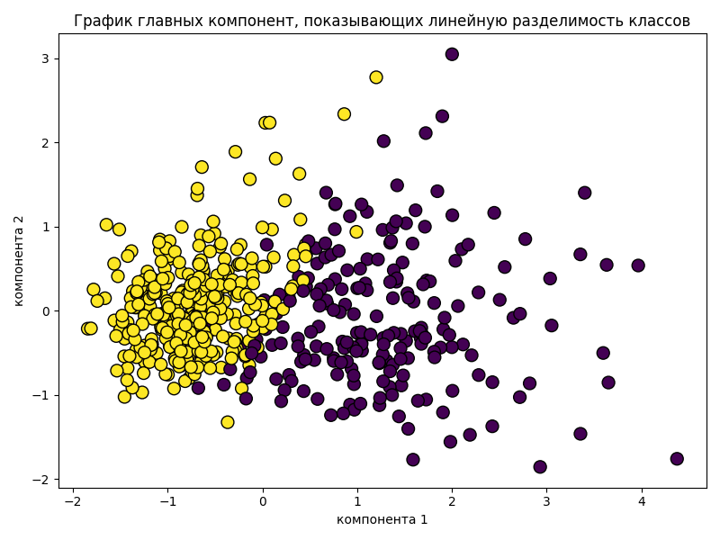

В целом классы линейно разделимы, значит, данный датасет подходит для нашей задачи.

## 3. Реализация собственного бинарного классификатора и стохастического градиентного спуска
Основные части проекта реализованы в виде отдельных классов для унификации(упрощения) процессов создания и обучения моделей. Конструктор бинарного классификатора представлен ниже:
```
class BinaryClassificator():
    def __init__(
        self,
        init_type: str = "none",
        optimizer_type: str = "SGD",
        loss_type: str = "hinge",
        subsampling_type: str = "random",
        lr: float = 1e-4,
        reg_coef: float = 0.0,
        m: int = 3,
        momentum: float = 0.0,
        nesterov: bool = False,
        batch_size: int = 4,
        n_iters: int = 100
    ):
```
В него можно передать все параметры, описанные в задании к лабораторной работе. Пользователь может тестировать различные комбинации параметров для поиска оптимальных значений, сильно не меняя код. Cтоит отметить, что в конструкторе происходит валидация значений параметров, чтобы не допустить неопределенности при обучении модели. Также бинарный классификтор по аналогии с sklearn имеет методы fit и predict для обучения и получения предсказаний модели.

Для модели бинарной классификации указывается тип оптимизатора, в нашем случае - это SGD, чей конструктор представлен ниже: 
```
class SGD():
    def __init__(
        self,
        init_type: str = "none",
        loss_type: str = "hinge",
        subsampling_type: str = "random",
        lr: float = 1e-4,
        reg_coef: float = 0.0,
        m: int = 3,
        momentum: float = 0.0,
        nesterov: bool = False,
        batch_size: int = 4,
        n_iters: int = 100
    ):
```
Моя реализация SGD частично отличается от той, что была представлена в лекции. Вместо выбора 1 объекта из выборки выбирает N неодинаковых объектов длиной batch_size, что позволяет алгоритму быстрее сойтись к глобальному минимуму. Также в процессе выполнения лабораторной работы выяснилось, что метод наискорейшего градиентного спуска не может быть реализован для батча объектов, так как при вычислении производной по h мы получим batch_size векторов, направленных каждый в своем направлении, соответственно, мы не можем выбрать направление градиента. По этой причине был придуман такой алгоритм: для каждого объекта из батча находится h*, а затем среди всех не нулевых h* выбирается минимум. Все остальные расчеты производятся согласно формулам из лекции.

## 4. Обучение и тестирование первой модели
Параметры обучения модели:
```
custom_model1 = BinaryClassificator(
    init_type = "none",
    subsampling_type = "margin_abs",
    lr = 1e-4,
    reg_coef = 0.3,
    m = 3,
    momentum = 0.7,
    nesterov = True,
    n_iters = 150
)
```
Ниже представлены графики изменения функции потерь, эмпирического риска и шага обучения:

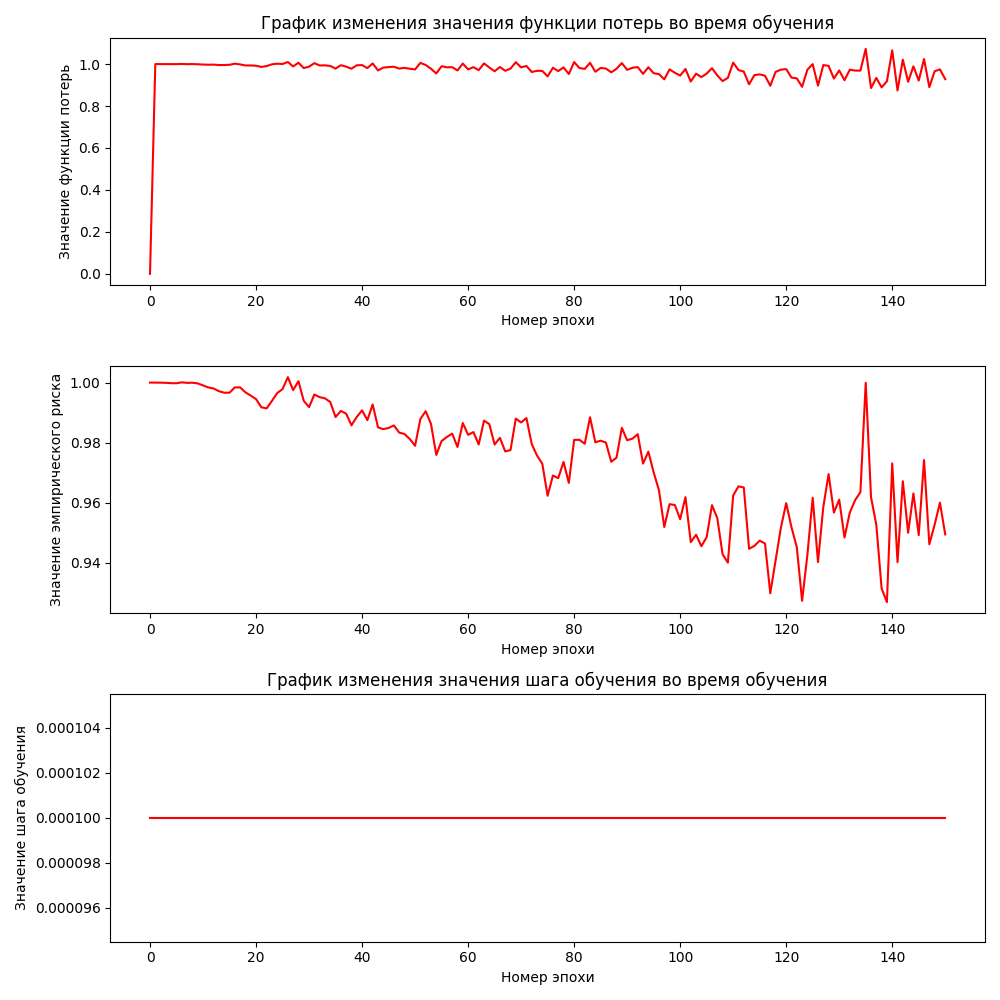

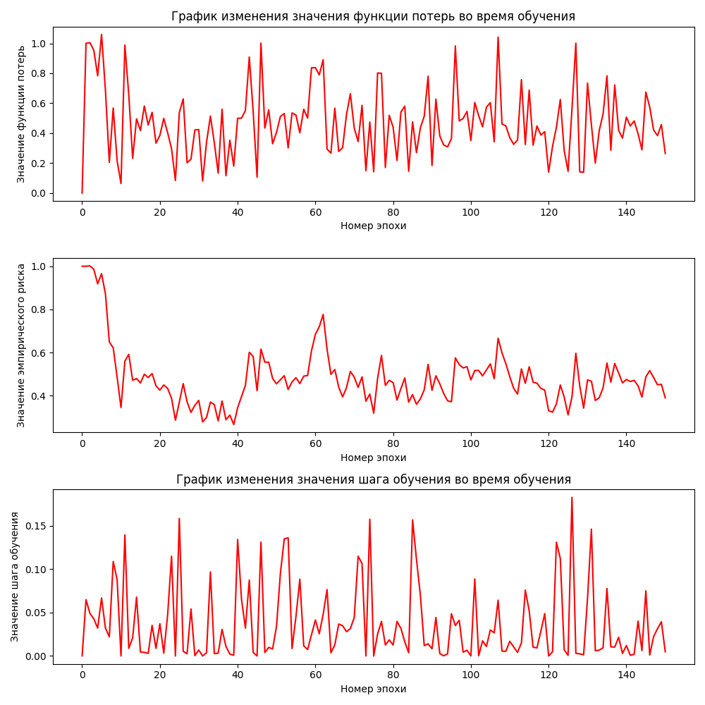

Графики имеют скачкообразный вид, что говорит о нестабильном процессе обучения.

Ниже представлены графики отступов на тренировочной/тестовой выборках:

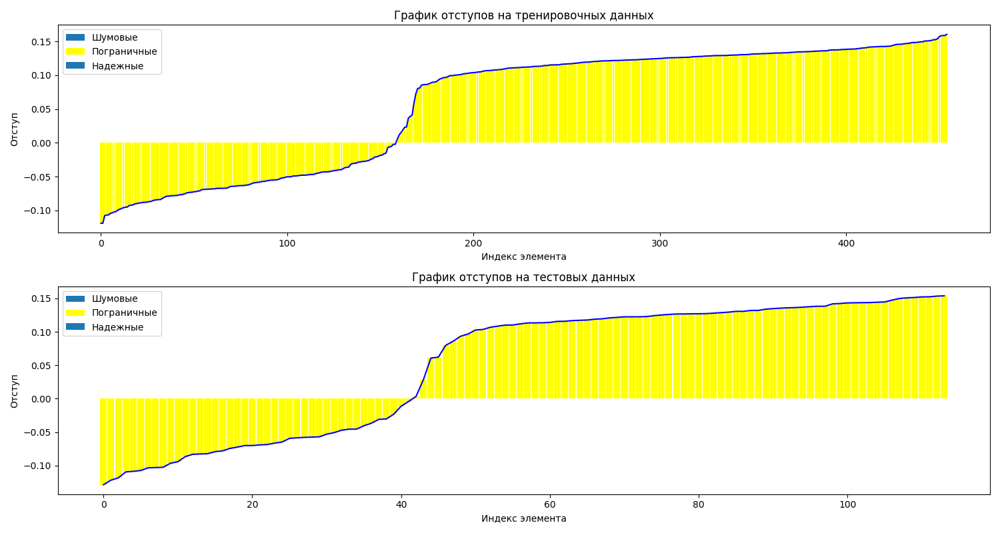


Модель в целом уверена в своих предсказаниях, но есть довольно большие пики с отрицательным отступом, что говорит о том, что модель не может определить класс объекта. Несмотря на все вышеописанные недостатки, качество предсказаний модели довольно высокое.

Метрики качества работы данной модели:
| split | Accuracy | Precision | Recall | F1 Score | Q |
|------|------|------|------|------|------|
| train | 0.8857 | 0.9032 | 0.8857 | 0.8799 | 0.2286 |
| test | 0.8509 | 0.8804 | 0.8509 | 0.8417 | 0.2982 |

## 5. Обучение и тестирование второй модели
Параметры обучения модели:
```
custom_model2 = BinaryClassificator(
    init_type = "corr",
    subsampling_type = "margin_abs",
    lr = 1e-4,
    reg_coef = 0.3,
    m = 3,
    momentum = 0.7,
    nesterov = True,
    n_iters = 150
)
```
Ниже представлены графики изменения функции потерь, эмпирического риска и шага обучения:


По графикам видно, что начальная инициализация весов была очень удачная, так как мы сразу оказались рядом с хорошим локальным минимумом.

Ниже представлены графики отступов на тренировочной/тестовой выборках:

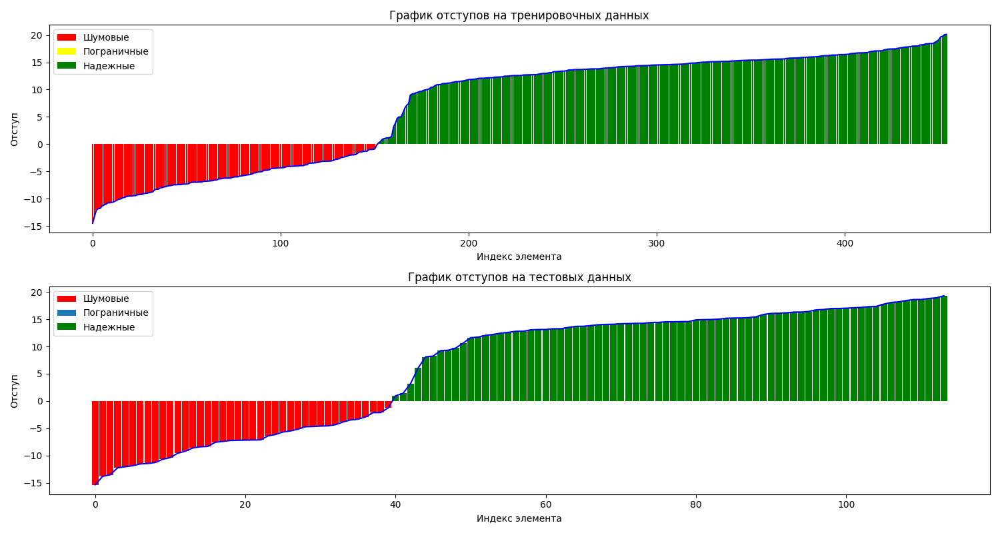


Данная модель еще больше уверена в предсказаниях чем предыдущая. Метрики также выше чем у предыдущей модели.

Метрики качества работы данной модели:
| split | Accuracy | Precision | Recall | F1 Score | Q |
|------|------|------|------|------|------|
| train | 0.9143 | 0.9245 | 0.9143 | 0.9113 | 0.1714 |
| test | 0.8684 | 0.8919 | 0.8684 | 0.8617 | 0.2632 |

## 6. Обучение и тестирование третьей модели
Параметры обучения модели:
```
custom_model3 = BinaryClassificator(
    init_type = "multi_start",
    subsampling_type = "margin_abs",
    lr = 1e-4,
    reg_coef = 0.3,
    m = 3,
    momentum = 0.7,
    nesterov = True,
    n_iters = 150
)
```
Ниже представлены графики изменения функции потерь, эмпирического риска и шага обучения:

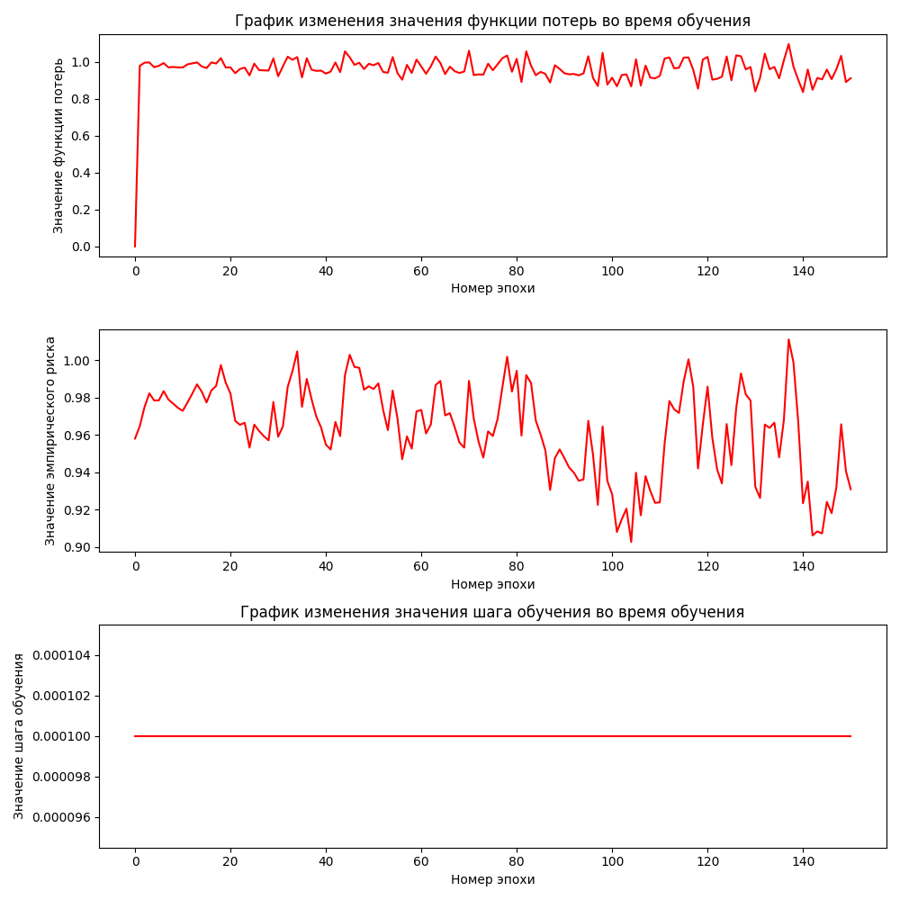
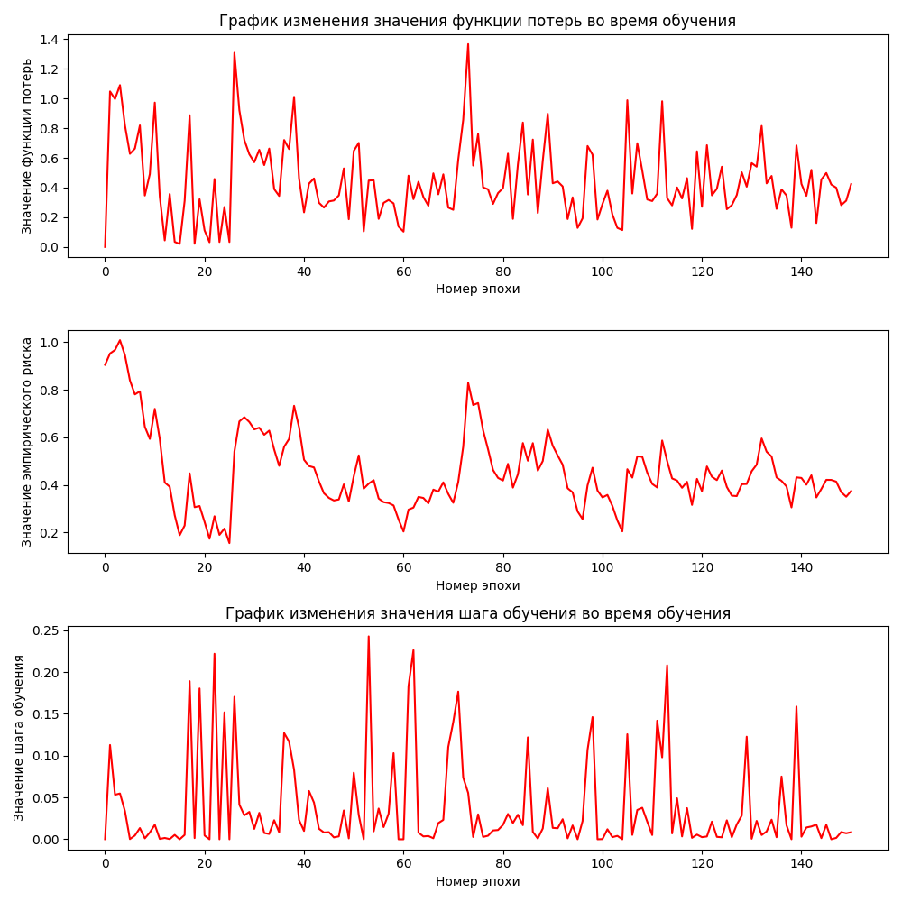

Данная модель также не успела сойтись, так как график лосса скачкообразный.

Ниже представлены графики отступов на тренировочной/тестовой выборках:


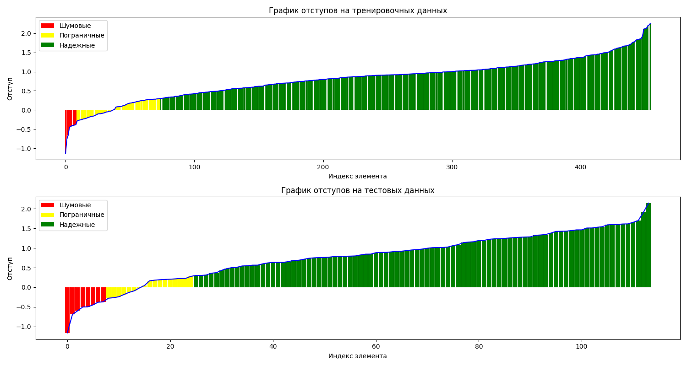

Уверенность предсказаний и метрики данной модели находится примерно на том же уровне, что и у предыдущих.

Метрики качества работы данной модели:
| split | Accuracy | Precision | Recall | F1 Score | Q |
|------|------|------|------|------|------|
| train | 0.9187 | 0.9279 | 0.9187 | 0.9161 | 0.1626 |
| test | 0.8684 | 0.8919 | 0.8684 | 0.8617 | 0.2632 |

## 7. Обучение и тестирование четвертой модели
Параметры обучения модели:
```
custom_model4 = BinaryClassificator(
    init_type = "multi_start",
    subsampling_type = "random",
    lr = 1e-4,
    reg_coef = 0.3,
    m = 3,
    momentum = 0.7,
    nesterov = True,
    n_iters = 150
)
```
Ниже представлены графики изменения функции потерь, эмпирического риска и шага обучения:

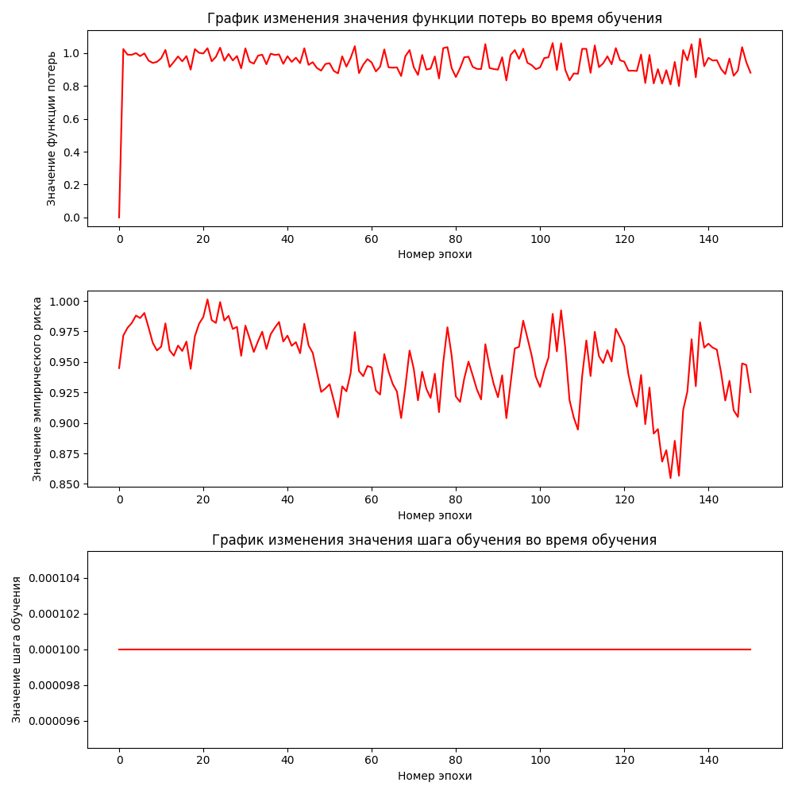
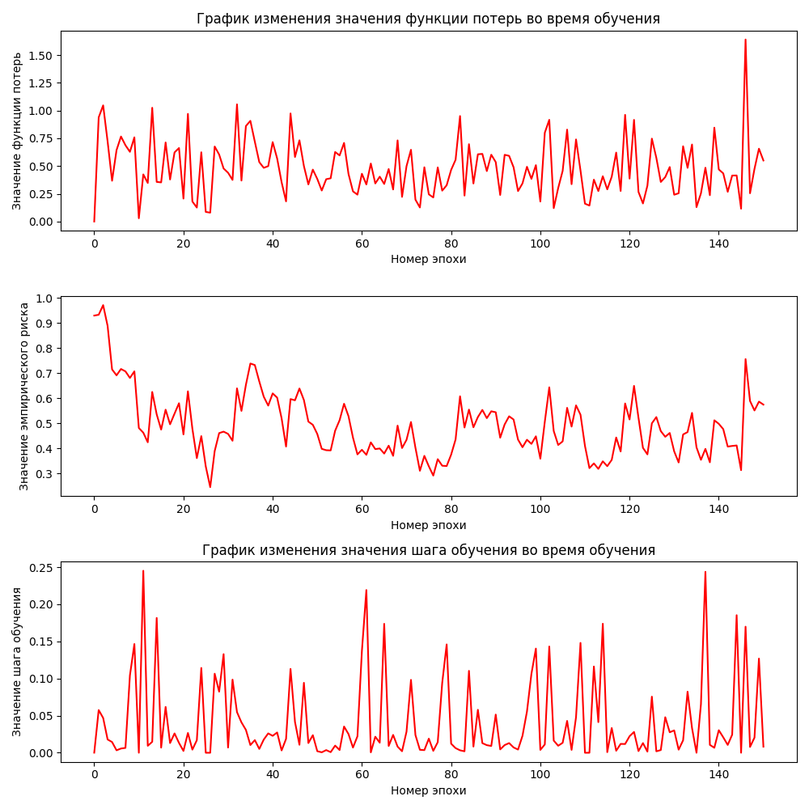

Графики изменения лосса и эмпирического риска также выглядит скачкообразно, что говорит о слишком большом шаге обучения.

Ниже представлены графики отступов на тренировочной/тестовой выборках:


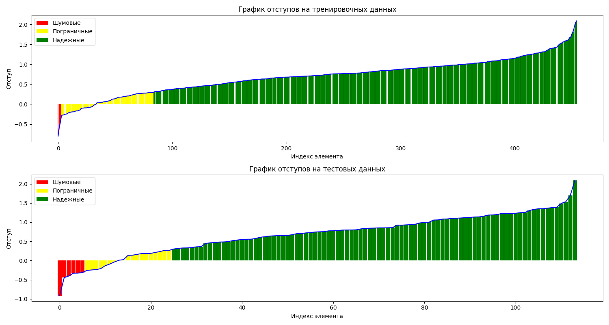

По уверенности предсказаний модель ничем не отличается от предыдущих, хотя по метрикам есть небольшой прирост в 1-2%.

Метрики качества работы данной модели:
| split | Accuracy | Precision | Recall | F1 Score | Q |
|------|------|------|------|------|------|
| train | 0.9253 | 0.9332 | 0.9253 | 0.9231 | 0.1495 |
| test | 0.8860 | 0.9040 | 0.8860 | 0.8812 | 0.2281 |

## 8. Обучение и тестирование моделей из библиотеки sklearn

В качестве эталонных моделей из библиотеки sklearn я взял SVC и LogisticRegression, так как это одни из самых популярных моделей, которые берут в качестве baseline для решения задач классификации. К сожалению, для моделей из библиотеки невозможно построить графики со статистикой обучения, поэтому сравнить данные модели с моими можно будет только по метрикам.

Ниже представлены графики отступов на тренировочной/тестовой выборках для SVC и LogisticRegression:

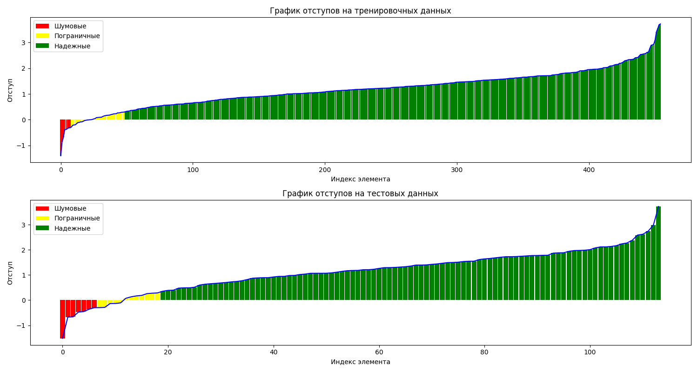

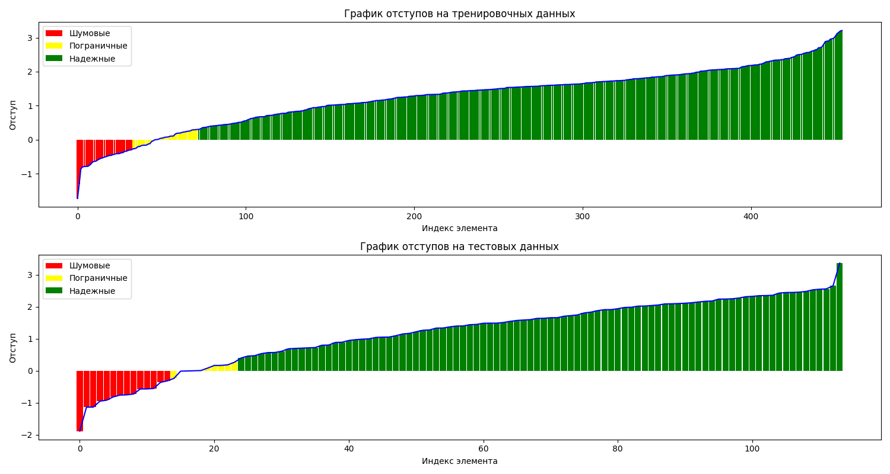


| Split | Model                  | Accuracy | Precision | Recall | F1 Score | Q |
| ----- | ---------------------- | -------- | --------- | ------ | -------- | -------- |
| Train | **SVC**                | 0.9802   | 0.9805    | 0.9802 | 0.9801   | 0.1055 |
|       | **LogisticRegression** | 0.9736   | 0.9743    | 0.9736 | 0.9734   | 0.2066 |
| Test  | **SVC**                | 0.9298   | 0.9371    | 0.9298 | 0.9283   | 0.2105 |
|       | **LogisticRegression** | 0.9211   | 0.9302    | 0.9211 | 0.9191   | 0.2982 |
