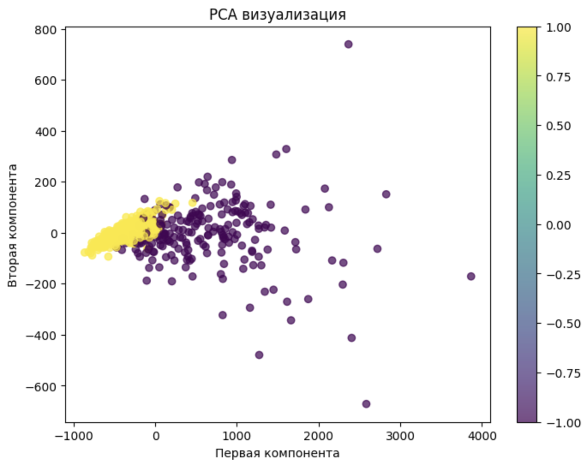
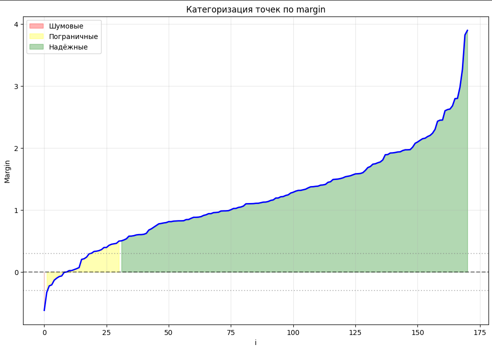
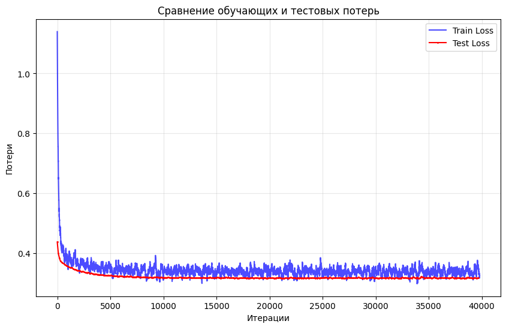

# Отчет по лабораторной работе №1: Линейная классификация

## Цель работы

Реализация линейного классификатора с обучением методом стохастического градиентного спуска с инерцией, L2 регуляризацией и квадратичной функцией потерь, различными вариантами инициализации весов, различными вариантами подбора элементов.

## Подготовка данных

**Датасет:** Breast Cancer Wisconsin Dataset (569 образцов, 30 признаков)

- Целевая переменная: бинарная классификация
- Преобразование меток: 0 → -1, 1 → 1
- Нормализация данных: MinMaxScaler
- Разделение: 70% обучение, 30% тестирование

## Визуализация данных

### PCA визуализация



Анализ показывает наличие двух основных кластеров с некоторым перекрытием, что указывает на возможность линейного разделения классов.

### t-SNE визуализация


t-SNE подтверждает наличие двух кластеров с областями перекрытия, что объясняет неидеальную точность классификатора.

## Реализация алгоритма

### Основные компоненты:

1. **Функция потерь:** Логистическая функция потерь (LogLoss)
2. **Оптимизаторы:**
   - SGD без инерции
   - SGD с инерцией (MomentumOptimizer)
   - Nesterov Accelerated Gradient (NAGOptimizer)
3. **Регуляризация:** L2 / без регуляризации
4. **Инициализация весов:**
   - Случайная (random)
   - На основе корреляции (corr)
   - Мультистарт (multistart)

### Ключевые особенности реализации:

- Рекуррентная оценка функционала качества с коэффициентом забывания
- Предъявление объектов по модулю отступа
- Стохастический градиентный спуск с инерцией

## Результаты экспериментов

### Распределение margin



### График обучения




На первом рисунке изображен график лосса для градиентного спуска без инерции, на втором рисунке для Nesterov Accelerated Gradients. Второй рисунок показывает более быструю скорость сходимости к минимуму при использовании метода с инерцией. В обоих случаях наблюдается быстрое снижение функции потерь в начале обучения с последующей стабилизацией, что подтверждает корректность реализации алгоритма.

### Результаты классификации

**Реализованный классификатор:**

```
Confusion Matrix:
[[ 56   7]
 [  2 106]]

Accuracy: 0.947
F1-score: 0.947
Precision: 0.948
Recall: 0.947
```

**Эталонное решение (sklearn.SGDClassifier):**

```python
model = SGDClassifier(
    loss='log_loss',
    penalty='l2', 
    alpha=0.01,
    max_iter=1,
    tol=None,
    random_state=42
)

n_epochs = 1000
for epoch in range(n_epochs):
    model.partial_fit(X_train, y_train, classes=np.unique(y_train))

y_pred = model.predict(X_test)
```

```
Confusion Matrix:
[[ 56   7]
 [  2 106]]

Accuracy: 0.947
Precision: 0.948
Recall: 0.947
F1-score: 0.947
```

## Анализ результатов

### Сравнение с эталоном

| Метрика   | Реализованный | sklearn | Разница |
| --------- | ------------- | ------- | ------- |
| Accuracy  | 0.947         | 0.947   | 0       |
| Precision | 0.948         | 0.948   | 0       |
| Recall    | 0.947         | 0.947   | 0       |
| F1-score  | 0.947         | 0.947   | 0       |

В случае выполненной реализации использовался классический градиентный спуск с оптимизатором без инерции с инициализацией весов с корреляцией, результат в точности совпадает с полученным в эталонном решении.

## Выводы

1. **Корректность реализации:** Алгоритм успешно сходится, что подтверждается графиком потерь
2. **Качество классификации:** Достигнута точность, совпадающая с эталонной
3. **Визуализация данных:** PCA и t-SNE подтверждают возможность линейного разделения с некоторыми ограничениями

Реализованный классификатор демонстрирует работоспособность основных принципов линейной классификации и стохастического градиентного спуска с инерцией.
