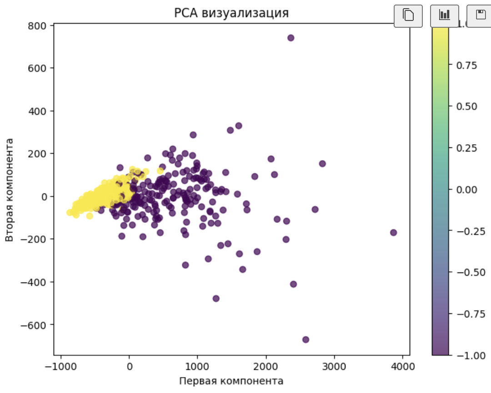
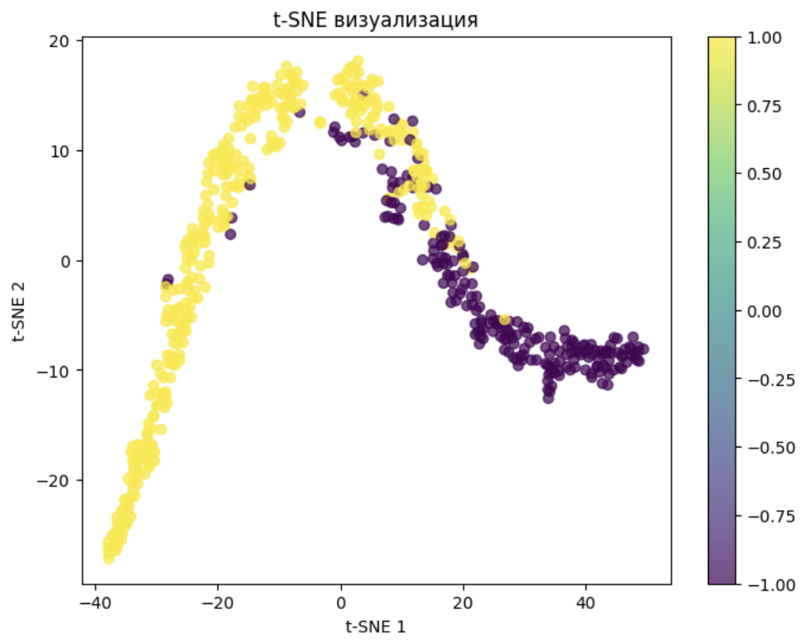
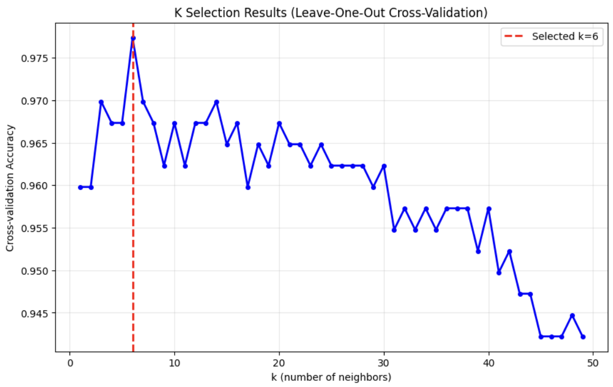
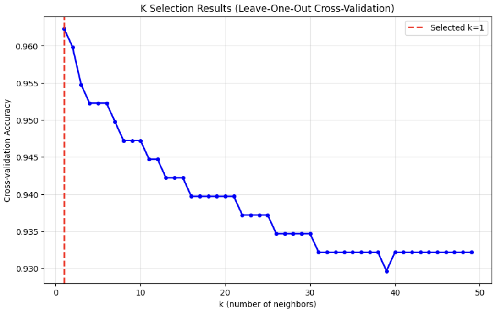
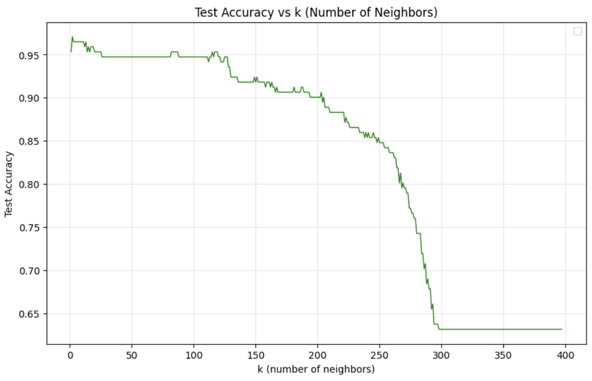
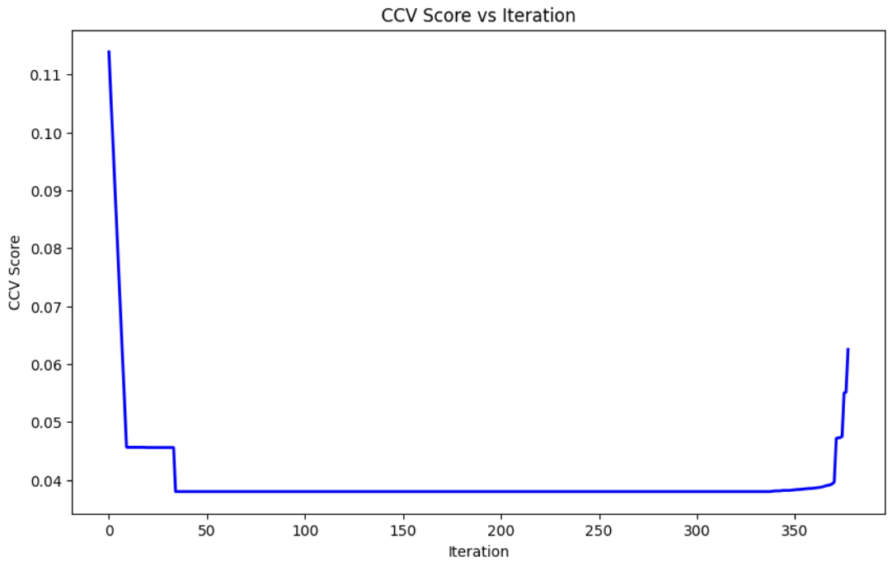
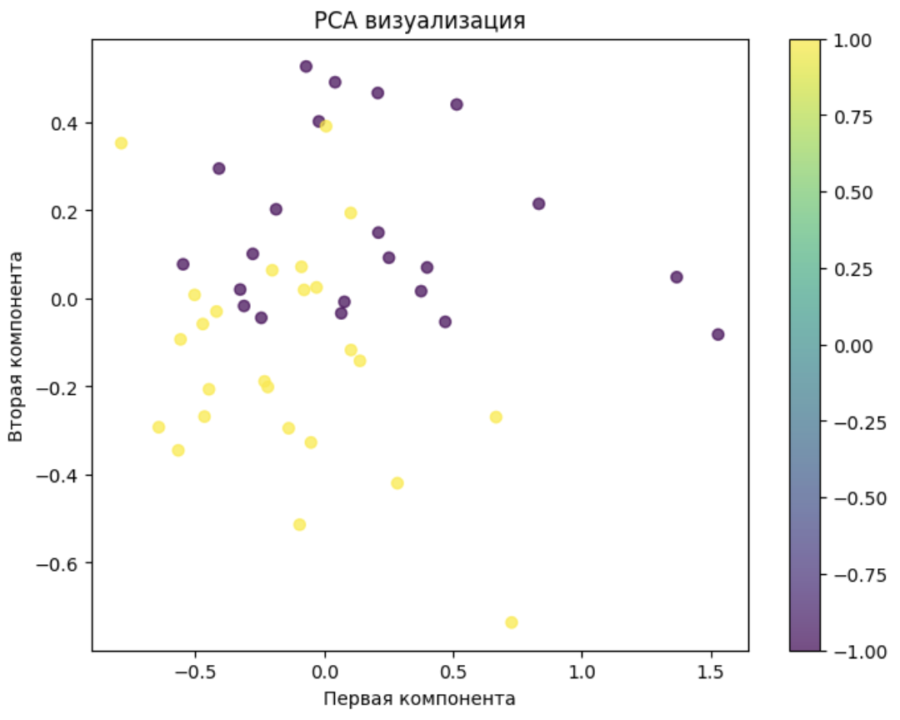

# Отчет по лабораторной работе №2: Метрическая классификация

## Цель работы

Реализация алгоритма классификации KNN с методом окна Парзена переменной ширины, подбор параметра k методом скользящего контроля (LOO), реализация алгоритма отбора эталонов и сравнение качества работы алгоритмов.

## Подготовка данных

**Датасет:** Breast Cancer Wisconsin Dataset (569 образцов, 30 признаков)

- Целевая переменная: бинарная классификация
- Преобразование меток: 0 → -1, 1 → 1
- Нормализация данных: MinMaxScaler
- Разделение: 70% обучение, 30% тестирование

## Визуализация данных

### PCA визуализация



Анализ показывает наличие двух основных кластеров с некоторым перекрытием, что указывает на возможность метрической классификации с использованием расстояний между объектами.

### t-SNE визуализация



t-SNE подтверждает наличие двух кластеров с областями перекрытия, что объясняет необходимость тщательного подбора параметров метрических алгоритмов.

## Реализация алгоритма

### Основные компоненты:

1. **KNN классификатор:** Реализован с поддержкой различных ядер
2. **Ядра:**
   - Гауссово ядро (gaussian)
   - Прямоугольное ядро (rectangular)
   - Треугольное ядро (triangular)
   - Ядро Епанечникова (epanechnikov)
3. **Метод скользящего контроля:** Leave-One-Out (LOO) для подбора параметра k
4. **Алгоритм отбора эталонов:** Complete Cross-Validation (CCV) для минимизации эталонной выборки

### Ключевые особенности реализации:

- Матрица расстояний для оптимизации вычислений
- Автоматический подбор оптимального k методом LOO
- Итеративное удаление эталонов с минимизацией CCV score
- Поддержка различных ядер для взвешивания соседей

## Результаты экспериментов

### Подбор параметра k методом LOO



Оптимальное значение k = 6 выбрано методом скользящего контроля с максимальной точностью кросс-валидации. График показывает зависимость точности кросс-валидации от количества соседей k, где максимум достигается при k = 6.

### Сравнение ядер



Сравнение прямоугольного и гауссового ядер показывает, что гауссово ядро демонстрирует более низкую точность кросс-валидации по сравнению с прямоугольным ядром. Максимальная точность при гауссовом ядре достигается при k = 1, но остается ниже результата прямоугольного ядра при k = 6.

### Обоснование выбора параметров

**Выбор k = 6:**

- Метод LOO показал максимальную точность кросс-валидации при k = 6
- Значение k = 6 обеспечивает баланс между устойчивостью к выбросам и сохранением локальной структуры данных
- При меньших значениях k алгоритм становится чувствительным к шуму, при больших - теряет локальность

**Выбор прямоугольного ядра:**

- Прямоугольное ядро показало лучшую производительность по сравнению с гауссовым
- Гауссово ядро демонстрирует падение точности из-за избыточного сглаживания весов соседей
- Прямоугольное ядро обеспечивает четкое разделение между ближайшими и дальними соседями

### Результаты классификации

**Эталонное решение (sklearn.KNeighborsClassifier):**

```
Confusion Matrix:
[[ 60   3]
 [  3 105]]

Accuracy: 0.965
Precision: 0.965
Recall: 0.965
F1-score: 0.965
```

**Реализованный KNN классификатор:**

```
Confusion Matrix:
[[ 59   4]
 [  2 106]]

Accuracy: 0.965
Precision: 0.965
Recall: 0.965
F1-score: 0.965
Selected k: 6
```

### Анализ зависимости точности от k



График показывает зависимость точности классификации на тестовой выборке от количества соседей k. Максимальная точность достигается при k = 6, что подтверждает корректность автоматического подбора параметра методом LOO.

### Алгоритм отбора эталонов



График показывает изменение CCV score в процессе итеративного удаления эталонов. Алгоритм Complete Cross-Validation минимизирует ошибку классификации, последовательно удаляя наименее информативные эталоны.

**Результаты после отбора эталонов:**

```
Confusion Matrix:
[[ 60   3]
 [  5 103]]

Accuracy: 0.953
Precision: 0.954
Recall: 0.953
F1-score: 0.953
Selected k: 6
Train size: 47
```

Размер обучающей выборки сокращен с 398 до 47 объектов (88% сокращение) при сохранении высокой точности классификации.

**Преимущества стратегии с отбором эталонов:**

- **Ускорение классификации:** Сокращение размера обучающей выборки в 8.5 раз значительно ускоряет процесс классификации новых объектов
- **Удаление выбросов:** Алгоритм CCV автоматически исключает объекты, которые не улучшают качество классификации, что повышает устойчивость к шуму
- **Компактность модели:** Уменьшение количества эталонов делает модель более компактной и интерпретируемой

### Визуализация эталонной выборки



PCA визуализация сокращенной выборки показывает сохранение основных кластеров данных при значительном уменьшении количества эталонов с 398 до 47 объектов. Структура данных остается узнаваемой, что подтверждает эффективность алгоритма отбора эталонов.

## Анализ результатов

### Сравнение с эталоном

| Метрика   | Реализованный | sklearn | Разница |
| --------- | ------------- | ------- | ------- |
| Accuracy  | 0.965         | 0.965   | 0       |
| Precision | 0.965         | 0.965   | 0       |
| Recall    | 0.965         | 0.965   | 0       |
| F1-score  | 0.965         | 0.965   | 0       |

Реализованный алгоритм демонстрирует идентичную производительность с эталонной реализацией sklearn.

### Эффективность отбора эталонов

| Параметр       | До отбора | После отбора | Изменение |
| -------------- | --------- | ------------ | --------- |
| Размер выборки | 398       | 47           | -88%      |
| Accuracy       | 0.965     | 0.953        | -1.2%     |
| Precision      | 0.965     | 0.954        | -1.1%     |
| Recall         | 0.965     | 0.953        | -1.2%     |
| F1-score       | 0.965     | 0.953        | -1.2%     |

Алгоритм отбора эталонов обеспечивает значительное сокращение размера обучающей выборки при минимальной потере качества классификации.

## Выводы

1. **Корректность реализации:** Алгоритм KNN успешно реализован с поддержкой различных ядер
2. **Качество классификации:** Достигнута точность, идентичная эталонной реализации
3. **Эффективность подбора параметров:** Метод LOO обеспечивает оптимальный выбор k = 6
4. **Отбор эталонов:** Алгоритм CCV сокращает размер выборки на 88% при потере точности менее 1.2%

Реализованный метрический классификатор демонстрирует работоспособность основных принципов KNN и эффективность алгоритмов отбора эталонов для оптимизации размера обучающей выборки.
